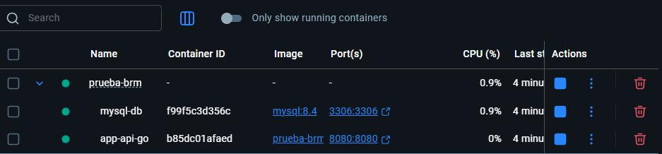
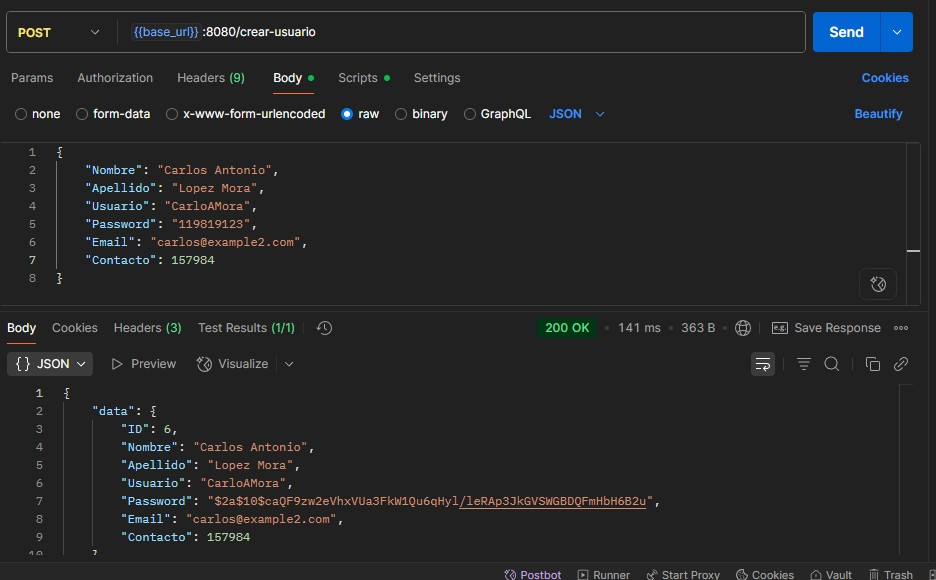
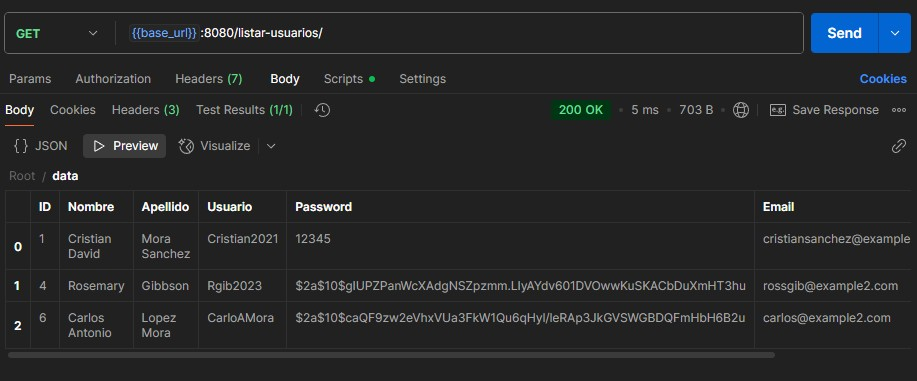
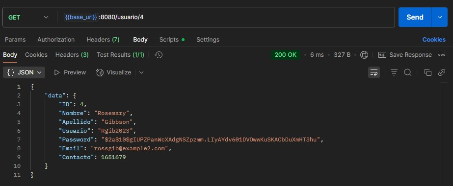
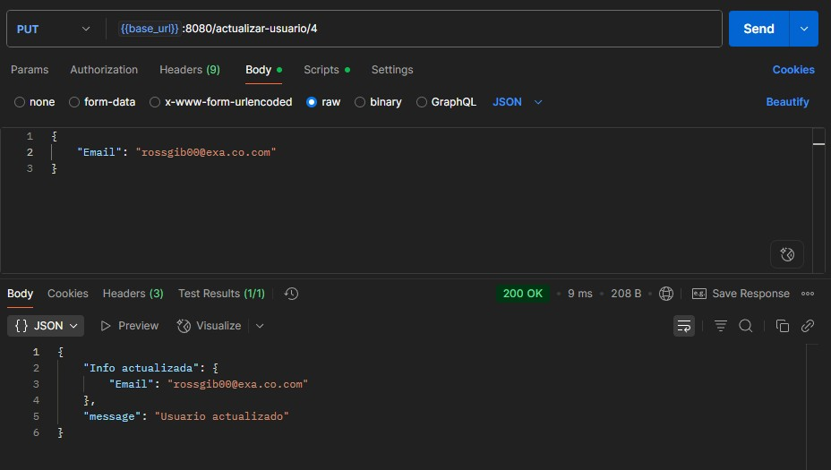
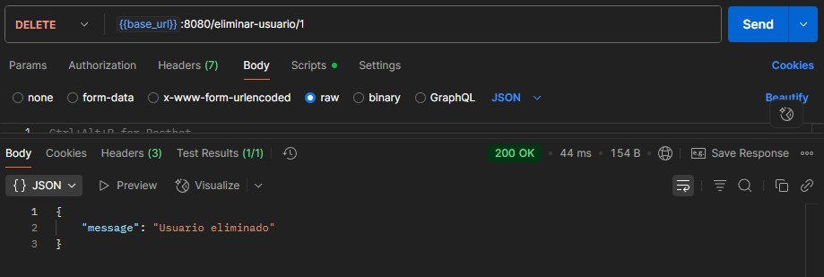

# 🏗️ Proyecto API REST en Go (Golang)

Programado por: Cristian David Mora Saenz

E-mail: cr.mora00@gmail.com

---

## 📖 Descripción
Esta API REST fue desarrollada como parte de la prueba técnica para **BRM S.A.** Su objetivo principal es permitir la gestión de usuarios a través de operaciones como **crear**, **consultar**, **listar**, **actualizar** y **eliminar** registros.

El servicio está construido utilizando el lenguaje **Golang**, siguiendo una arquitectura limpia y modular. Como motor de persistencia se utiliza **MySQL**, lo cual garantiza un manejo eficiente y escalable de los datos.

La API está diseñada para facilitar la integración mediante herramientas como **Postman** y puede adaptarse fácilmente a distintos entornos de desarrollo o producción.

---
## 🔩 Patrón de diseño (MVC)

Me gusta trabajar con el patrón de diseño **MVC** porque considero que ofrece una estructura robusta y bien definida. Es ampliamente adoptado por diversos frameworks para organizar proyectos, lo que lo convierte en una opción práctica y adaptable a diferentes lenguajes de programación y herramientas de desarrollo.

---

## 🎖️ ¿Qué aprendi?

Durante el desarrollo de este proyecto, tuve la oportunidad de sumergirme por primera vez en el lenguaje **Golang**. Elegí este stack en lugar de optar por algo más familiar como **Node.js**, con el objetivo de ampliar mis conocimientos y explorar nuevas herramientas en el ecosistema backend.

Al principio, comprender la sintaxis de Go y su enfoque estructurado fue un desafío. Sin embargo, a medida que fui avanzando, descubrí una gran satisfacción en su claridad, su rendimiento y, especialmente, en su **flexibilidad para organizar el código de forma modular**. Me pareció muy interesante cómo se pueden integrar librerías para construir funcionalidades de manera progresiva, permitiendo escalar la solución sin perder orden ni control.

Esta experiencia no solo reforzó mi habilidad para aprender tecnologías desde cero, sino que también despertó en mí un interés genuino por seguir explorando todo lo que **Golang** puede ofrecer en el desarrollo de APIs robustas y eficientes.

---

## 🛠️ ¿Qué mejoraria?

Considero fundamental incorporar un módulo de **autenticación** y un sistema de **roles y permisos**, que permita controlar el acceso a ciertos recursos y operaciones. Esta funcionalidad no solo reforzaría la seguridad del sistema, sino que también lo haría más completo y preparado para aplicaciones reales en producción.

---

## 🏁 ¿Qué complementaría?

Me gustaría implementar la creación de un **frontend interactivo**, posiblemente utilizando **React**, una de mis tecnologías favoritas. Esto permitiría mostrar el funcionamiento de la API de manera más visual e intuitiva, facilitando tanto las pruebas como la comprensión por parte de los usuarios.

---

## ⚙️ Tecnologías
| Herramienta | Versión mínima | Uso principal |
|-------------|----------------|---------------|
| Go          | 1.24           | Lógica del servidor |
| Gin         | 1.10.1         | Router HTTP |
| GORM        | 1.30           | Capa de persistencia |
| Docker Desktop    |  4.41.2 | Contener api |

---

## 📝 Requisitos previos
```bash
# Go
go 1.24.4
# Postman
Descargar https://www.postman.com/downloads/
# Docker
Descargar https://www.docker.com/
# Xampp
Descargar https://www.apachefriends.org/es/index.html

```

## 📦 Instalacion
### 1. Clona el repositorio

```bash
git clone https://github.com/CristianMDS/Prueba-BRM.git
cd Prueba-BRM
```

### 2. Instalar Docker

> **⚠️ Advertencia:** Recuerda tener instalado e iniciado Docker.

### 3. Instalar MySQL

> **⚠️ Advertencia:** Recuerda tener MySQL.

### Verifica MySQL en Docker:


### 4. Construye y levanta los contenedores
```bash
docker compose up --build
```

### 5. Probar en postman 
| Direccion | tipo de peticion | JSON |
|-------------|----------------|----------------|
| http://localhost:8080/crear-usuario       |     POST     | { "Nombre": "", "Apellido": "", "Usuario": "", "Password": "", "Email": "", "Contacto": 0} |
| http://localhost:8080/listar-usuarios       |     GET     | N/A |
| http://localhost:8080/usuario/:id       |     GET     | N/A |

> **⚠️ Advertencia:** El email siempre debe ser unico para cada usuario.

### 6. Crea, actualiza y elimina un usuario en postman

> **👍 Consejo:** Recuerda Utilizar las "Direcciones" dentro del cuadro para agilizar el proceso de la prueba.

| Accion | Direccion | tipo de peticion |
|-------------|-----------|----------------|
|    Crear un Usuario     | http://localhost:8080/crear-usuario       |     POST     |
|    Actualizar un Usuario     | http://localhost:8080/actualizar-usuario/:id       |     PUT     |
|    Eliminar un Usuario     | http://localhost:8080/eliminar-usuario/:id       |     DELETE     |

> **⚠️ Advertencia:** Recuerda remplazar el **:id** con el id del usuario tanto en PUT, DELETE o GET (SI ES EL CASO).

### 7. Apaga los contenedores.

```bash
docker compose down
```

---

## 📂 Estructura del proyecto
```bash
.
├── controller/
│   └── actualizar.go       # Controlador para actualizar usuario
│   └── hashPassword.go     # Controlador para encriptar contraseñas
├── database/
|   └── database.go         # Conexion con la base de datos
├── models/
|   └── usuario.go          # Modelo de los Usuarios
├── routes/
|   └── routes.go           # Archivo de enrutamiento
└── main.go                 # Archivo principal
```

---

## ⚙️ Uso de la API
| Método | Endpoint | Descripcion | Body JSON Ejemplo |
|-------------|----------------|---------------|--------------|
| GET          | /listar-usuarios | Listar todos los usuarios | - |
| POST         | /crear-usuario | Crear un usuario | { "Nombre": "string", "Apellido": "string", "Usuario": "string", "Password": "string", "Email": "string", "Contacto": numeric} |
| GET        | /usuario/{id} | Listar un solo usuario usando su {id} | - |
| PUT      | /actualizar-usuario/{id} | Actualizar un usuario con su {id} | { "Nombre": "string", "Apellido": "string", "Usuario": "string", "Password": "string", "Email": "string", "Contacto": numeric} |
| DELETE      | /eliminar-usuario/{id} | Eliminar un usuario con su {id} | - |

---

## 📷 Peticion POST

### Peticion POST en postman para crear usuarios:


## 📷 Peticiones GET

### Peticion GET en postman para listar usuarios:


### Peticion GET en postman utilizando el id:


## 📷 Peticion PUT

### Peticion PUT en postman para actualizar a los usuarios:


## 📷 Peticion DELETE

### Peticion DELETE en postman para eliminar usuarios:


---

## 🧾Licencia MIT
```bash
MIT License

Copyright (c) 2025 Cristian Mora Saenz

Permission is hereby granted, free of charge, to any person obtaining a copy
of this software and associated documentation files (the "Software"), to deal
in the Software without restriction, including without limitation the rights
to use, copy, modify, merge, publish, distribute, sublicense, and/or sell
copies of the Software, and to permit persons to whom the Software is
furnished to do so, subject to the following conditions:

The above copyright notice and this permission notice shall be included in all
copies or substantial portions of the Software.

THE SOFTWARE IS PROVIDED "AS IS", WITHOUT WARRANTY OF ANY KIND, EXPRESS OR
IMPLIED, INCLUDING BUT NOT LIMITED TO THE WARRANTIES OF MERCHANTABILITY,
FITNESS FOR A PARTICULAR PURPOSE AND NONINFRINGEMENT. IN NO EVENT SHALL THE
AUTHORS OR COPYRIGHT HOLDERS BE LIABLE FOR ANY CLAIM, DAMAGES OR OTHER
LIABILITY, WHETHER IN AN ACTION OF CONTRACT, TORT OR OTHERWISE, ARISING FROM,
OUT OF OR IN CONNECTION WITH THE SOFTWARE OR THE USE OR OTHER DEALINGS IN THE
SOFTWARE.
```
